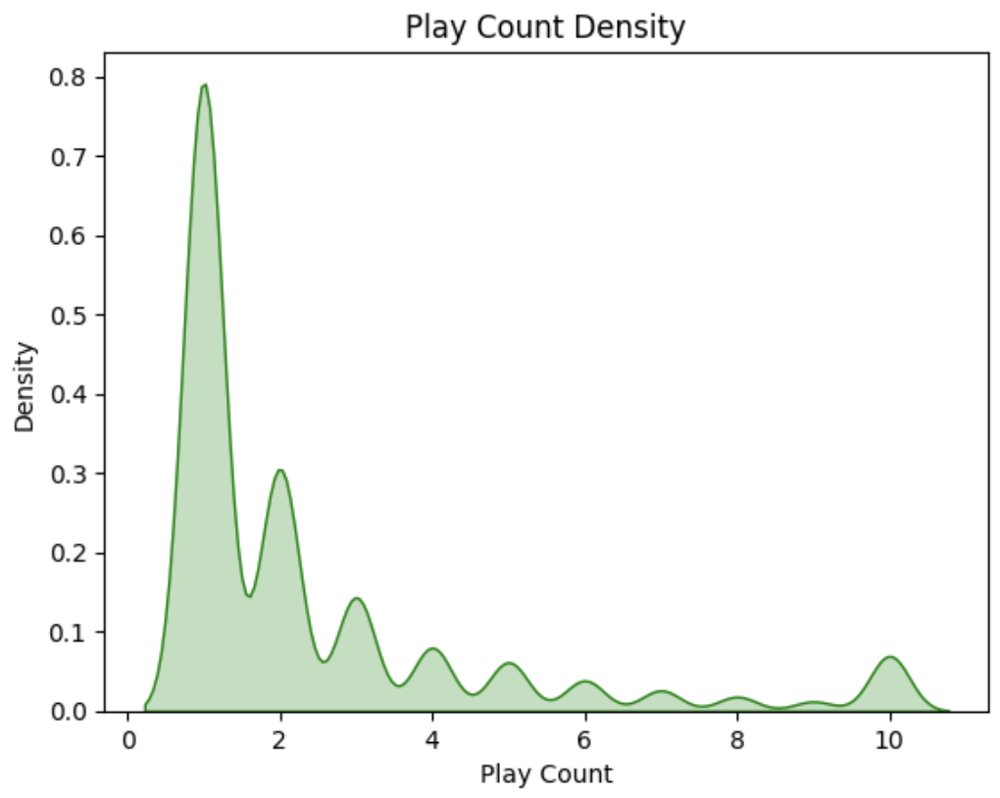
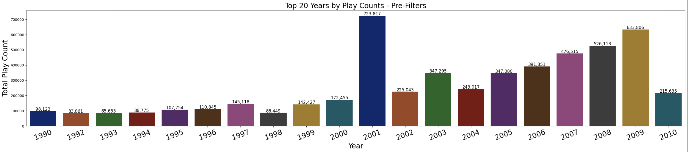
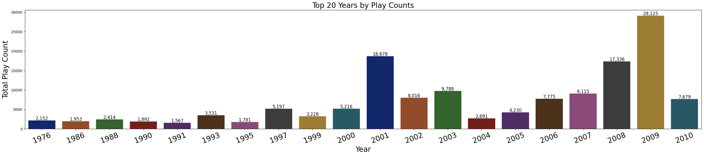

# Music Recommendation System Project

## MIT Professional Education - Applied Data Science Program

This project was completed as part of the MIT Professional Education Applied Data Science Program capstone, and it aims to build a music recommendation system. Utilizing various data science and machine learning techniques, this system is designed to curate top songs tailored to individual user preferences, enhancing the music discovery experience on platforms like Spotify.

### About the Author

I'm Amanda Angelico, a legal professional with over 12 years of experience in Copyright Administration, Rights & Clearances, and Project/Program Management within major media and entertainment companies. I have a deep passion for data science, which I've woven into my career to drive effective decision-making with data-driven insights. In today’s data-centric business environment, my dual expertise has become an invaluable asset, bridging the gap between legal frameworks and innovative data applications to advance operational excellence.

## Problem Definition

### Context

Technology has reshaped how we live, making our daily lives more time-efficient while simultaneously increasing the opportunities for distraction. People are better able to multitask but may struggle with attention span or finding time for artistic endeavors. Fortunately, technology has made it easier for people to discover art & entertainment, even with limited time and attention.

For most internet-based companies, the business model depends on capturing and retaining user interest. In order to be effective, these platforms need to make music discovery less of a chore and more of a personalized experience.

### Objectives

- Develop a recommendation system that predicts songs based on user listening history and interactions.
- Incorporate song characteristics and user preferences to provide personalized music recommendations.
- Evaluate the system's effectiveness through engagement metrics and adaptability to new music trends.

## Data Overview

The project utilizes the Taste Profile Subset from the Echo Nest as part of the Million Song Dataset. Key data points include:

### Data Dictionary

- **song_data:**
  - `song_id`: A unique id given to every song
  - `title`: Title of the song
  - `Release`: Name of the released album
  - `Artist_name`: Name of the artist
  - `year`: Year of release

- **count_data:**
  - `user_id`: A unique id given to the user
  - `song_id`: A unique id given to the song
  - `play_count`: Number of times the song was played

### Data Source

- [Million Song Dataset](http://millionsongdataset.com/)
- [song_df and count_df](https://drive.google.com/drive/folders/1ODwlvrIwPPIYnwJcAu8K0ALYNMOZM2C9)

## Exploratory Data Analysis (EDA)

The analysis revealed challenges such as the right-skewed distribution of play counts and the overrepresentation of songs from certain years. Insights and visualizations are detailed within the Jupyter notebook accompanying this project.

## Key Challenges

Challenges such as missing genre information and the limitations of existing models were addressed through model iteration and solution design. Our approach included collaborative filtering, matrix factorization, and the suggestion of exploring hybrid models for enhanced recommendation performance.

## Model Development

A combination of User-User and Item-Item Collaborative Filtering, Matrix Factorization using SVD, and Content-Based filtering techniques were employed. The project suggests a hybrid model as a promising solution for providing accurate and personalized recommendations.

## Conclusions and Future Work

The project lays the foundation for a sophisticated music recommendation system, suggesting continuous improvement and adaptation based on user feedback. Future directions include feature engineering, data enrichment, and implementing feedback mechanisms for model refinement.

## Additional Resources

- Please refer to the [Jupyter notebook](https://github.com/amandaangelico/Data-Science-Projects/blob/main/Music-Recommendation-System/Music_Recommendation_System_Spotify_Dataset_Amanda_Angelico.ipynb) and [presentation slides](https://github.com/amandaangelico/Data-Science-Projects/blob/main/Music-Recommendation-System/Music_Recommender_System_MIT_2024.pdf) for a comprehensive analysis and discussion.

## License

This project is for educational use only, completed as part of the MIT Professional Education's Applied Data Science Program.

