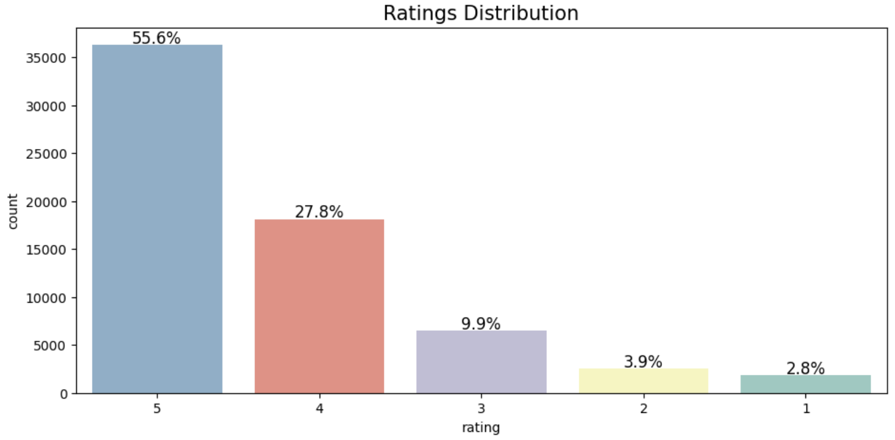
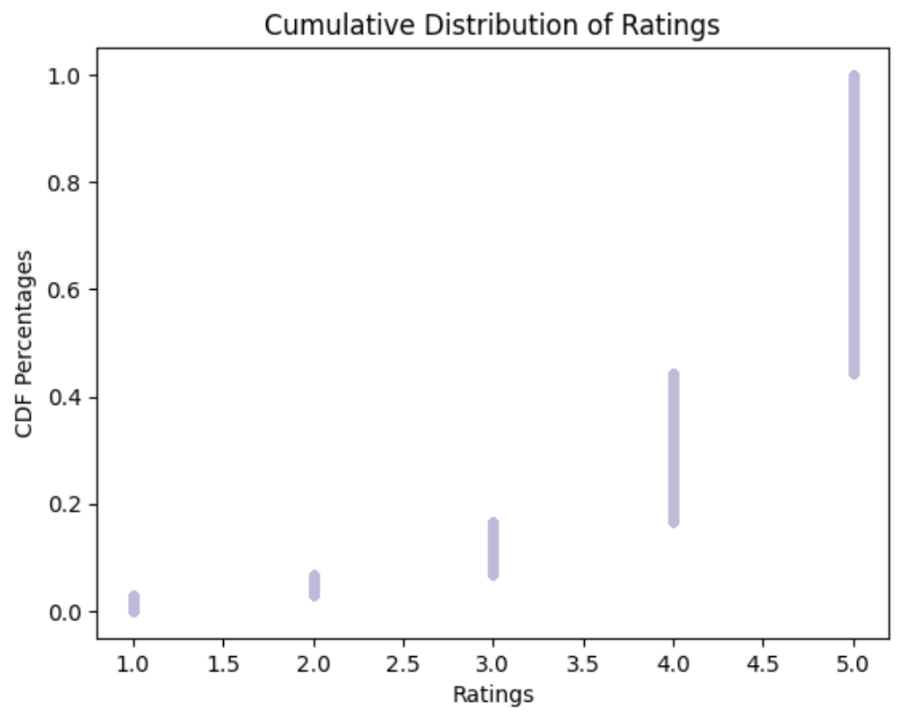
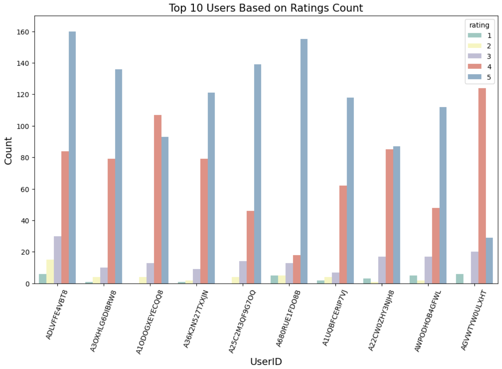

# Product Recommendation System Project

## MIT Professional Education - Applied Data Science Program

This project was part of the MIT Professional Education Applied Data Science Program, and it aims to explore and implement a product recommendation system utilizing various data science and machine learning techniques. It is designed to enhance the online shopping experience by offering personalized product suggestions based on user preferences, thereby supporting customer retention and fostering a loyal customer base.

## Problem Definition

### Context

In today's world, consumers are often overwhelmed by the vast array of choices available online, which can lead to issues with indecision. Recommender systems have emerged as vital tools in alleviating this issue by providing tailored product suggestions, thus enhancing the shopping experience and aiding in customer retention.

### Objective

As a Data Scientist at Amazon, the goal is to build a recommendation system that leverages Amazon's extensive product reviews dataset to predict and recommend products to customers based on their past ratings and interactions. The provided dataset includes electronics products only.

## Data Overview

### Data Dictionary

- **userID**: Every user identified with a unique id
- **productId**: Every product identified with a unique id
- **Rating**: The rating of the corresponding product by the corresponding user
- **timestamp**: Time of the rating (dropped in preprocessing)

### Data Source

- [Amazon Ratings Dataset](https://drive.google.com/file/d/1XahZcR287ke7j48I7-oj0KzmmwSSvA3Y/view)

## Data Import and Cleaning

Given the dataset's size and the sparsity of user-product interactions, logical filters were applied to focus on users who have given at least 50 ratings and products with at least 5 ratings. This preprocessing step aimed to enhance model accuracy and computational efficiency.

## Exploratory Data Analysis (EDA)

The EDA focused on understanding the distribution of user ratings and identifying patterns and potential biases in user-product interactions. Initial findings highlighted a predominant number of 5-star ratings, indicating possible areas for model improvement.

    

    

Above, we see that the y-axis is representing the percentage/proportion of observations with a value less than or equal to a given x-value. As an example, 60% of the data is less than or equal to 5; 40% of the data is less than or equal to 4, etc. This visualization echoes what we've seen with our other plots, showing that there is an exceedingly high amount of 5-star ratings compared against the rest of the distribution.

    

The most active users are more inclined to give higher reviews according to our analysis, and although there are several possible explanations for this, it does raise some level of suspicion regarding ratings authenticity/data quality.

## Key Challenges

- **Data Sparsity**: The reduction of the dataset introduces challenges in model performance due to limited interactions.
- **High Rating Bias**: A skew towards 5-star ratings raises concerns about the authenticity of reviews and potential impact on model recommendations.
- **Feature Limitations**: The absence of additional product features or categories limits the depth of analysis and model precision.

## Model Development

Several models were explored, including User-User and Item-Item Collaborative Filtering and Matrix Factorization using SVD. The iterative process focused on balancing precision, recall, and RMSE to identify the most effective model for product recommendation.

## Conclusions and Future Work

The analysis suggests that a Matrix Factorization model using SVD provides the best balance in performance. Addressing data sparsity and rating bias through strategies such as data enrichment and leveraging real-time user feedback could further enhance recommendation accuracy and user satisfaction.

## Additional Resources

For a comprehensive analysis and discussion, please refer to the [Jupyter notebook](https://github.com/amandaangelico/Data-Science-Projects/blob/main/Product-Recommendation-System/Product_Recommendation_System_Amazon_Dataset_Amanda_Angelico.ipynb).

## License

This project is for educational use only, completed as part of the MIT Professional Education's Applied Data Science Program.

