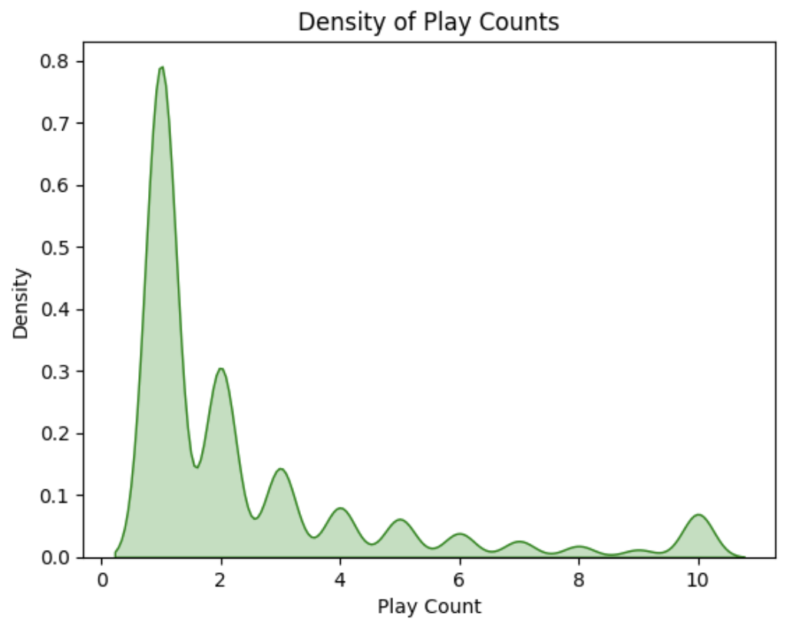
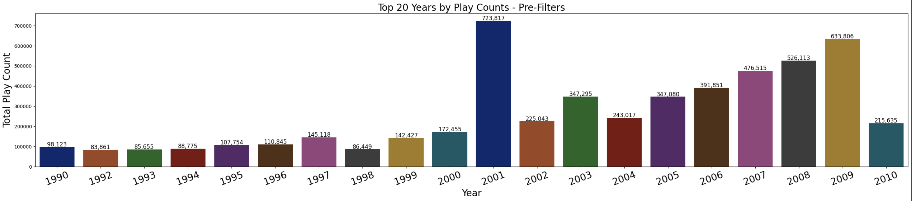

# Data-Science-Projects
Assignments &amp; Personal Portfolio 
# MIT Professional Education's Applied Data Science Program
## Music Recommendation System Project

### Contributors: Amanda Angelico

This project was completed by Amanda Angelico and is part of the coursework for MIT Professional Education's Applied Data Science Program. It aims to explore and implement a music recommendation system utilizing various data science and machine learning techniques.

### About the Author

Amanda is a Legal professional with 12+ years in Copyright Administration, Rights & Clearances, and Project/Program Mgmt. for major media and entertainment companies. She pairs this background with a passion for data science and a longheld belief that statistical methodologies can and should be utilized to solve business problems in any context. 

### License

This project is completed as part of the MIT Professional Education's Applied Data Science Program and is for educational use only. 

## Problem Definition

### Context

Technology has reshaped how we live, making our daily lives more time efficient while simultaneously increasing the opportunities for distraction. People are better able to multitask but may struggle with attention span or finding time for artistic endeavors. Fortunately, technology has made it easier for people to discover art & entertainment, even with limited time and attention.

For most internet-based companies, the business model depends on capturing and retaining user interest. Spotify stands out by using powerful recommendation systems to connect millions of listeners with billions of songs, making music discovery less of a chore and more of a personalized experience.

### Objective

The project's goal is to build a recommendation system designed to curate the top songs for a user, tailored specifically to their listening preferences and predicted likelihood of enjoyment.

### Key Questions and Considerations

- **Identifying User Preferences:** How will we evaluate user listening history to successfully and accurately infer user preferences?
- **Song Characteristics:** What features of songs are most predictive of user preferences?
- **Personalized Experience for Users:** How can we capture individual preferences instead of basing recommendations on general popularity?
- **Engagement Metrics:** What metrics can measure the success of our recommendations?
- **Model Adaptability and Scalability:** How do we continuously integrate new genres and artists into the mix?

## Problem Formulation

Our challenge is interpreting complex listening patterns from a massive dataset of songs and interactions. We aim to build models that predict potential song preferences with high accuracy, offer diverse recommendations, and evaluate effectiveness through metrics reflecting user satisfaction and platform engagement.

## Data Import and Cleaning

The core data comes from the Taste Profile Subset released by the Echo Nest as part of the Million Song Dataset. We first need to prepare the data for effective manipulation and model development. This involves handling trailing whitespaces, dropping unnecessary columns, imputing any missing values, merging our respective datasets into a final dataframe, and applying filters/constraints/thresholds.

## Data Dictionary

- **song_data:**
  - `song_id`: A unique id given to every song
  - `title`: Title of the song
  - `Release`: Name of the released album
  - `Artist_name`: Name of the artist
  - `year`: Year of release

- **count_data:**
  - `user_id`: A unique id given to the user
  - `song_id`: A unique id given to the song
  - `play_count`: Number of times the song was played

## Data Source

[Million Song Dataset](http://millionsongdataset.com/)

## Exploratory Data Analysis (EDA)

In evaluation of the play_count distribution, the majority of users interacted with songs around 1 play count, which makes it challenging to evaluate user preference. The play_count feature is largely right-skewed. 

The most prominent year in our final dataset is 2009, followed by 2008 and 2001. The year 2001 seems to be overepresented in the data. Prior to instating filters, 2001 was the most frequent year of release, but this issue is reduced in part after applying user play count thresholds. 

## Key Challenges

- We're missing information about genre, and this could be extremely useful to draw better relationships from the data. If a particular user likes certain genres, it's much easier to know what kinds of songs to recommend. I think this is a critical issue in terms of missing features that are important to the problem. Additionally, tags or descriptors associated with these songs would be immensely helpful, and this would've likely improved our clustering algorithm.

- The imputation strategies for missing 'year' data, while necessary, introduce a degree of uncertainty in our analysis, suggesting the need for careful consideration in recommendations where temporal relevance is key. That said, we didn't use the yr data to draw very strong relationships between different songs. If we were to continue optimizing these models, perhaps we could tokenize year data for the content-based approach.

- Since we had to instate certain caps/filter cutoffs due to dataset size, we lost some important information about user preferences. We could adjust these figures to see if some of our existing models perform better than what we're currently seeing.

## Model Iteration & Solution Design

Our approach involved rigorous exploration and application of various recommendation models. Initial observations highlighted the diverse nature of Spotify's dataset, but missing data prompted imputation strategies. It would benefit all model performance to revisit these strategies and also utilize external datasets to populate missing features (genre, tags, etc.). The User-User and Item-Item Collaborative Filtering models provided a foundational understanding of user preferences, though they demonstrated limitations in precision and recall balance. Matrix Factorization using SVD emerged as a promising technique, offering a solid foundation for capturing user-song interactions with a reasonable balance between precision and recall. With that said, our optimized SVD model was possibly showing signs of overfitting, and the baseline model was offering better predictions that were roughly ~1 or less away from actual interaction counts.

- **Exploration**: Dive deeper into the nuances of each model - User-User Similarity-Based Collaborative Filtering, Item-Item Similarity-Based Collaborative Filtering, Matrix Factorization using SVD, Clustering, and Content-Based approaches. Evaluate their performances not just on the basis of RMSE, Precision, Recall, and F_1 Score, but also on their ability to engage users with novel and diverse recommendations. Particular attention should be paid to models showing signs of overfitting, as evidenced in some tuning exercises, to ensure that predictions remain robust and reliable across diverse user segments.

- **Hybrid Model Development**: Given the strengths and limitations observed in standalone models, developing a hybrid recommendation system that leverages the predictive power of Matrix Factorization in concert with the detailed personalization capabilities of Content-Based filtering presents a promising path forward. This approach aims to combine the scalability and depth of SVD with the nuanced, attribute-based recommendations possible with content analysis, potentially offering a richer, more engaging user experience.

- **Feature Engineering and Data Enrichment**: The current dataset, while extensive, lacks certain features like genre and song tags that could significantly enhance model performance. Future efforts should focus on integrating these elements, possibly through external data sources, to provide a more comprehensive basis for recommendation. This may include developing partnerships for data sharing or leveraging web scraping to enrich the existing dataset.

- **Engagement and Feedback Mechanisms**: Implementing a robust system for capturing real-time user feedback on recommendations can provide invaluable insights into model performance from the user's perspective. This feedback loop, coupled with detailed engagement metrics, can guide continuous model refinement and personalization.

- **Technical and Ethical Considerations**: As the system evolves, it's crucial to remain vigilant about the ethical implications of recommendation algorithms, particularly regarding data privacy, user consent, and the potential for reinforcing echo chambers. Transparent communication about how recommendations are generated and utilized can help mitigate these concerns.

- **A/B Testing and KPI Monitoring**: Regularly conducting A/B tests to compare different model variants and closely monitoring Key Performance Indicators (KPIs) related to user engagement, satisfaction, and retention will be essential in measuring the impact of the recommendation system on overall platform success. Adjustments and optimizations should be data-driven, grounded in the insights gathered from these evaluations.

The roadmap outlined above offers a strategic framework for navigating the complexities of building and deploying an effective music recommendation system. With a commitment to continuous learning, innovation, and user-centric design, we can look forward to achieving a more personalized, enjoyable music discovery experience for users.

## Conclusions

This project lays the groundwork for personalized music recommendations, suggesting a hybrid strategy that combines the strengths of Matrix Factorization and Content-Based methods for the best results. Continuous improvement based on user feedback and data analysis will help to ensure the system is effective in providing relevant recommendations. Please review the corresponding notebook and slides for additional analysis and discussion.
